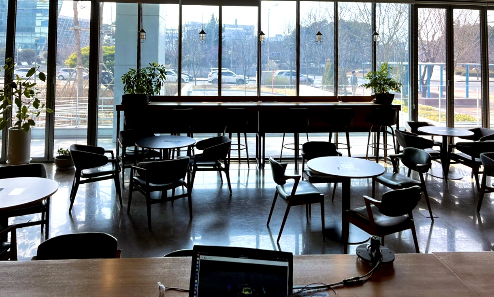

# Yujin LiDAR V2
Official Website: 
http://lidar.yujinrobot.com/

https://yujinrobot.com/autonomous-mobility-solutions/components/lidar/

## About Yujin LiDAR

YRL series LiDAR is designed to detect objects, measure distances from surroundings and collect data as point clouds. Yujin LiDAR is an optimized solution for indoor mapping, navigation, localization and other applications in a variety of industries including robotics, safety and security.

## YRL3V2 Scanning



## YRL3V2 Driver Package
### Build YRL3V2 Driver Package
```bash
git clone https://github.com/yujinrobot/yujin_lidar_v2.git
cd yujin_lidar_v2/driver_general/yujinrobot_yrldriver
mkdir build
cd build
cmake ..
make install
```
'lib_yujinrobot_yrldriver' is created in above.
In 'lib_yujinrobot_yrldriver', there are driver library, include files, and test code binaries.
You can use it when you build ros1, ros2 package, just copying it into ros1, ros2 package.

## ROS1 Package

- ROS Version: Noetic
- Maintainer Status: Developed
- License: BSD


## Supported Hardware
- YRL3V2-05 (3D, 5m)
- YRL3V2-10 (3D, 10m)
- YRL3V2-25 (3D, 25m)

## ROS Package Installation

```bash
/// 1st terminal
git clone https://github.com/yujinrobot/yujin_lidar_v2.git

/// 2nd terminal
source /opt/ros/noetic/setup.bash
mkdir -p ~/catkin_ws/src/
cd ~/catkin_ws/src/
*** copy 'yujin_yrl_v2_package' from 'yujin_lidar_v2/driver_ros1_noetic_ubuntu2004' to this directory
cd ..
catkin_make
source ~/catkin_ws/devel/setup.bash
rospack profile
```

## ROS API
- Package Name: yujin_yrl_v2_package
- Node Name: yrl_pub
- Publisher Name : yrl_pub
- Topic Name : yrl_cloud
### Parameters
YRL ROS driver imports YRL Linux driver. To get and set parameters of YRL ROS driver, please use APIs explained in the manual.

## QUICK START
```bash
/// 1st terminal
roscore

/// 2nd terminal 1st option
roslaunch yujin_yrl_v2_package yujin_yrl_v2.launch

/// 2nd terminal 2nd option
rosrun yujin_yrl_v2_package yrl_pub
rostopic echo /yrl_pub/yrl_cloud
rosrun rviz rviz
```
## Additional Software
### Viewer
- Ubuntu 20.04 is required.
#### For Linux: Dependency Installation
```bash
sudo apt-get install qt5-default
```
#### For Linux: Quick Start For Viewer
```bash
sudo -H ./Yujin_Lidar_Viewer.sh
```

  
Installing YRL3V2 ROS2 Driver 
=============

## Install ROS2 Foxy Fitzroy
### Add the ROS 2 apt repository
```
$ sudo apt update && sudo apt install curl gnupg2 lsb-release
$ sudo curl -sSL https://raw.githubusercontent.com/ros/rosdistro/master/ros.key  -o /usr/share/keyrings/ros-archive-keyring.gpg
$ echo "deb [arch=$(dpkg --print-architecture) signed-by=/usr/share/keyrings/ros-archive-keyring.gpg] http://packages.ros.org/ros2/ubuntu $(source /etc/os-release && echo $UBUNTU_CODENAME) main" | sudo tee /etc/apt/sources.list.d/ros2.list > /dev/null
```
### Install ROS2 Foxy Fitzroy
```
$ sudo apt update
$ sudo apt install ros-foxy-desktop
```
### Install ROS2 development tools
```
$ sudo apt update
$ sudo apt install -y python3-pip
$ sudo apt install -y build-essential
$ sudo apt install -y python3-colcon-common-extensions
$ pip3 install -U argcomplete
```
### Environment setup
```
$ echo "source /opt/ros/foxy/setup.bash" >> ~/.bashrc
```
### Try example nodes
```
Open a new terminal and run 'talker'
$ ros2 run demo_nodes_cpp talker

Open another terminal and run 'listener'
$ ros2 run demo_nodes_py listener
```

## Build YRL3V2 ROS2 Package
### Create a workspace
```
$ mkdir -p ~/colcon_ws/src
$ cd ~/colcon_ws
$ colcon build --symlink-install
```
### Environment setup for the worksapce
```
$ echo ". ~/colcon_ws/install/local_setup.bash" >> ~/.bashrc
```
### Clone 'yujin_lidar_v2' repository
```
$ git clone https://github.com/yujinrobot/yujin_lidar_v2.git

Copy 'yrl3_v2_ros2_package' in 'yujin_lidar_v2/driver_ros2_foxy_ubuntu2004' to ~/colcon_ws/src
```
### Build the YRL3V2 ROS2 package
``` 
Open a new terminal and build the package

$ cd ~/colcon_ws
$ colcon build
```

## How to Use ROS2 and YRL3V2 ROS2 Package
### Package execution (ros2 launch) : recommended
```
Launch files are located in '~/colcon_ws/src/yrl3_v2_ros2_package/launch'
1) yrl3_v2_ros2.launch.py (Python) 2) yrl3_v2_ros2.launch (XML)

Open a new terminal and run the launch file

$ ros2 launch < package_name > < launch_file_name >

# Example
$ ros2 launch yrl3_v2_ros2_package yrl3_v2_ros2.launch.py 
OR
$ ros2 launch yrl3_v2_ros2_package yrl3_v2_ros2.launch
```
### Package execution (ros2 run)
```
$ ros2 run < package_name > < node_name >

# Example
$ ros2 run yrl3_v2_ros2_package yrl3_v2_ros2_node

# For visualizing point data from yrl3_v2_ros2_node
$ rviz2 -d ~/colcon_ws/src/yrl3_v2_ros2_package/config/yrl3_v2_rviz2.rviz
```
### Parameter list of a running node
```
$ ros2 param list /< node_name >

# Example
$ ros2 param list /yrl3_v2_ros2_node
```
### Getting a parameter value in runtime
```
$ ros2 param get /< node_name > < parameter_name >

# Example
$ ros2 param get /yrl3_v2_ros2_node lidar_ip
```
### Setting a parameter value in runtime
```
$ ros2 param set /< node_name > < parameter_name > < parameter_value >

# Example
$ ros2 param set /yrl3_v2_ros2_node lidar_ip 192.168.1.250
$ ros2 param set /yrl3_v2_ros2_node scan_mode 1
$ ros2 param set /yrl3_v2_ros2_node extrinsic_transform "[0.0, 0.0, 0.07, 0.0, 0.0, 0.0]"
```
### Loading parameters from a file to a running node
```
$ ros2 param load /< node_name > < path_to_yaml_file >

# Example
$ ros2 param load /yrl3_v2_ros2_node ~/colcon_ws/src/yrl3_v2_ros2_package/config/lidar_params.yaml
```
### Loading a parameter file when starting a node
```
$ ros2 run < package_name > < node_name > --ros-args --params-file < path_to_yaml_file >

# Example
$ ros2 run yrl3_v2_ros2_package yrl3_v2_ros2_node --ros-args --params-file ~/colcon_ws/src/yrl3_v2_ros2_package/config/lidar_params.yaml
```
### Setting parameters when starting a node
```
$ ros2 run < package_name > < node_name > --ros-args -p < parameter_name >:=< parameter_value >

# Example
$ ros2 run yrl3_v2_ros2_package yrl3_v2_ros2_node --ros-args -p lidar_ip:="192.168.1.250" -p scan_mode:=1 -p extrinsic_transform:="[0.0, 0.0, 1.0, 0.0, 0.0, 0.0]"
```

# YRL3V2 LeGO-LOAM
LeGO-LOAM: https://github.com/RobustFieldAutonomyLab/LeGO-LOAM

Tested with ROS Noetic and YUJIN LiDAR YRL3V2

## Build YRL3V2 ROS Package
### Create a workspace
```
$ mkdir -p ~/catkin_ws/src/
$ cd ~/catkin_ws
$ catkin_make
```
### Environment setup for the worksapce
```
$ echo "source ~/catkin_ws/devel/setup.bash" >> ~/.bashrc
```
### Clone 'yujin_lidar_v2' repository
```
$ cd ~/Downloads
$ git clone https://github.com/yujinrobot/yujin_lidar_v2.git

Copy 'yujin_yrl_v2_package' in '~/Downloads/yujin_lidar_v2/driver_ros1_noetic_ubuntu2004' to '~/catkin_ws/src'
```
### Build the YRL3V2 ROS package
``` 
$ cd ~/catkin_ws
$ catkin_make
```

## Environment Set-up for YRL3V2 LeGO-LOAM
### Install dependencies 
```
Open a new terminal 

Install laser_assembler 
$ sudo apt install ros-noetic-laser-assembler
$ sudo apt install python-is-python3

Install gtsam for LeGO-LOAM
$ wget -O ~/Downloads/gtsam.zip https://github.com/borglab/gtsam/archive/4.0.0-alpha2.zip
$ cd ~/Downloads/ && unzip gtsam.zip -d ~/Downloads/
$ cd ~/Downloads/gtsam-4.0.0-alpha2/
$ mkdir build && cd build
$ cmake ..
$ sudo make install 

Install libparmetis
$ sudo apt-get install libparmetis-dev 
```
### Download 'LeGO-LOAM'
```
$ cd ~/catkin_ws/src/
$ git clone https://github.com/RobustFieldAutonomyLab/LeGO-LOAM.git
```
### Copy package
```
$ cd ~/catkin_ws/src/

Copy 'yrl_to_cloud' in 'yujin_lidar_v2/LeGO_LOAM_ros1_noetic_TestPackage_ubuntu2004' to '~/catkin_ws/src'
Replace 'LeGO-LOAM' in '~/catkin_ws/src/LeGO-LOAM' with 'yujin_lidar_v2/LeGO_LOAM_ros1_noetic_TestPackage_ubuntu2004/LeGO-LOAM'
```
### Modify yrl_pub.cpp
```
$ cd ~/catkin_ws/src/yujin_yrl_v2_package/src
$ gedit ./yrl_pub.cpp

Change code in line 308
br.sendTransform(tf::StampedTransform(transform, ros::Time::now(), "map", "yrl_cloud_id"));
=>
br.sendTransform(tf::StampedTransform(transform, ros::Time::now(), "base_link", "yrl_cloud_id"));
```
### Modify PCL
```
$ cd /usr/include/pcl-1.10/pcl/filters 
$ sudo gedit voxel_grid.h

In line 340 and 669,
Change 'Eigen::Index' to 'int' and save
```
### Modify utility.h
```
$ cd ~/catkin_ws/src/LeGO-LOAM/LeGO-LOAM/include
$ gedit utility.h

In line 57,
Change 'fileDirectory' to your directory for saving pcd files

ex) extern const string fileDirectory = "/home/tof-hjkim2/catkin_ws/";
```
### Build the YRL3V2 LeGO-LOAM
```
$ cd ~/catkin_ws/ 
$ catkin_make
```

## Map your environment
**Default scanning mode we support is mode 2, so please change LiDAR's scanning mode to 2 through viewer before trying mapping.
When obtaining point cloud data for mapping, data collection should be carried out by moving 0.5 meters and stopping for 2~3 seconds, and so on.
Also, REMOVE OBJECTS NEAR THE LIDAR to avoid poor quality of mapping.**

**When you start mapping your environment, DO MAP FIRST IN STRAIGHT COURSE. Take enough time for mapping though straight course to get enough data for making the map. After then, map in curved course rotating your robot.**

If you want to use LiDAR scanning mode 1, 3 and 4, 
you should modify the value of 'max_clouds' parameter in ~/catkin_ws/src/yrl_to_cloud/launch/assemble.launch
and values of 'N_SCAN', 'ang_res_y', 'ang_bottom' in ~/catkin_ws/src/LeGO-LOAM/LeGO-LOAM/include/utility.h

'max_clouds': As the vertical field of view increases, the buffer size must be increased. Because, to explore point clouds between consecutive frames for the full range of field of view, proportional amount of point clouds are needed. As 'max_clouds' increase, waiting time for mapping should be also increased. (scanning time of 1 cloud: 0.05 sec, scanning time for 'max_clouds': 0.05 * max_clouds)

'N_SCAN': This variable represents the number of channels for multichannel LiDAR. For YRL3V2 mode 2, 24 is the optimum value. You can also adjust this value in proportion to the size of the vertical field of view.

'ang_res_y': The resolution of the vertical axis, i.e. the y-axis. [Vertical FoV / (Number of channels-1)]

'ang_bottom': The lower vertical angle value for LiDAR's vertical field of view. For example, in case of mode 2, 'ang_bottom' is 5 because vertical field of view is from -5 degrees to 35 degrees.

All parameters mentioned above are carefully optimized for mode 2. If you would like to use other scanning mode, please refer to explanations above and change the variable values.

### Execute yrl_to_cloud package 
```
<Terminal 1>
$ cd ~/catkin_ws/src/yrl_to_cloud/src
$ chmod +x ./yrl2pc.py
$ roslaunch yrl_to_cloud assemble.launch

<Terminal 2>
$ cd ~/catkin_ws/
$ rosbag record /assemble_yrl

When your mapping is done, stop rosbag record.
```
### Run YRL3V2 LeGO-LOAM
```
<Terminal 1> 
$ roslaunch lego_loam run.launch

<Terminal 2>
$ cd ~/catkin_ws/
$ rosbag play < bagfile_name >.bag --clock --topic /assemble_yrl

<Terminal 3> 
$ cd ~/catkin_ws/
$ rosrun pcl_ros pointcloud_to_pcd input:=/laser_cloud_surround

Commands for terminal 3 is optional. If you want to get a map, run them, then you will get pcd files created (in your path set in utility.h) after LeGo-LOAM is finished. (ex. cornerMap.pcd, finalCloud.pcd, surfaceMap.pcd, trajectory.pcd and etc.)
```
